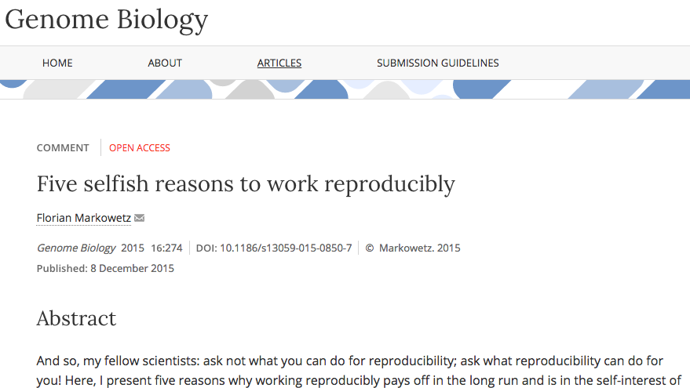
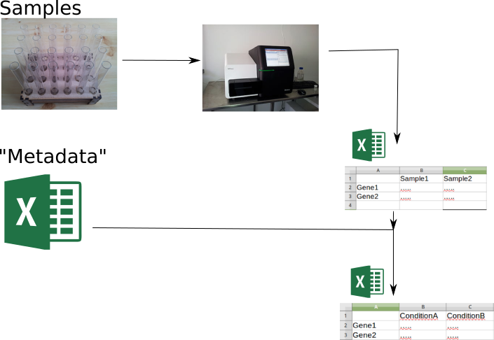
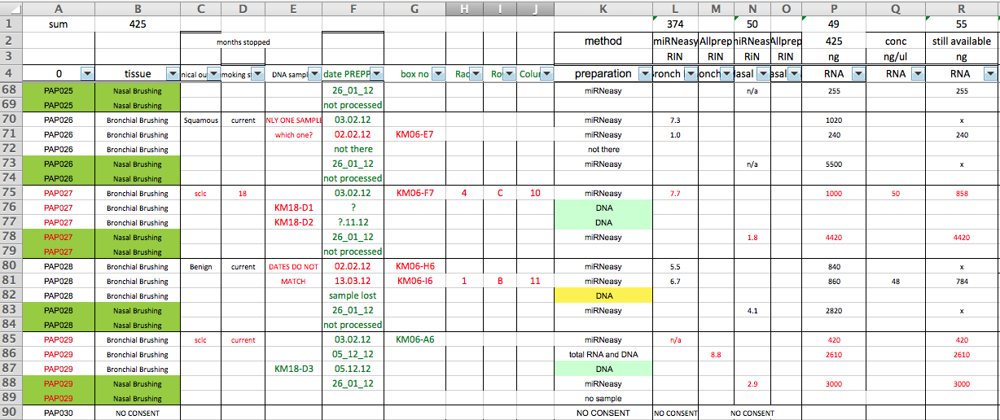
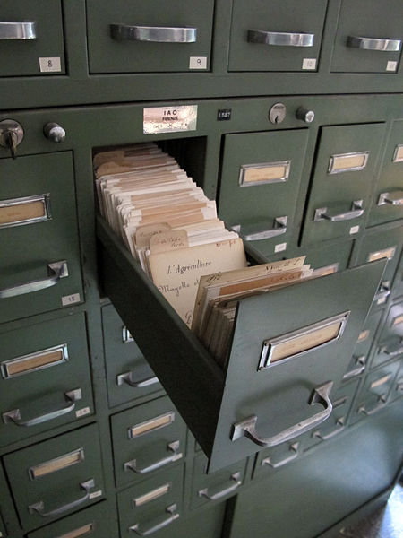

# Why is this course important?

---

# Reproducible Research

- As modern researchers, we should care about ***reproducible research***. 
- At some point in the future, someone, somewhere, might want to repeat your analysis for themselves or re-use your data. 
    + which will most likely be ***you!***
- Assuming that you'll be able to remember all the steps involved is dangerous, so making sure that everything is well-documented is key. 
- The documentation involves not only the methods used, but the files used as input and any transformations performed on them. 

---

# Five selfish reasons

- Florian Markowetz has a great talk on why we should work reproducibly 
- There is a [Genome Biology paper](http://genomebiology.biomedcentral.com/articles/10.1186/s13059-015-0850-7) that you should read.

---

# A famous example
- Probably the most (in)famous example of failure to reproduce a study, which actually *put people's lives at risk* and [rallied statisticians into action](http://www.nytimes.com/2011/07/08/health/research/08genes.html)
- Keith Baggerly's lecture on the scandal is a ***must-see***.

<iframe width="560" height="315" src="https://www.youtube.com/embed/7gYIs7uYbMo" frameborder="0" allowfullscreen></iframe>

---

# But tools like R have been around for years; why is this still an issue?

- R is only part of the solution
- Say you use an R script to generate a list of interesting genes and come to publish
    + which set of samples was used....the one with that dodgy sample removed
    + didn't you change the version of the software and re-run it?
    + what filters did you apply afterwards
- Need complete control over the files and data associated with your project

---

# Key concepts

The key areas that we will address in this course are:-

1. Making sure the analysis can be automated
2. Knowing exactly what files were used as input and output
3. Making your data available to others

---

# Barriers to learning R, Python etc

- Hopefully you will take the opportunity to learn a course to learn a language such as [R](http://cambiotraining.github.io/r-intro/) or [Python](http://pycam.github.io/) for your data analysis. 
- From experience, the biggest hurdle that newcomers to these languages face itrying to read and analyse your own data
- Often not because you have not understood the course materials....
- ....but because the data have been managled into a form that the computer cannot process. 
- there's a danger of becoming de-motivated and resorting back to whatever software you were using before.

---

# Are spreadsheets programs like Excel evil?

- ....Not neccesarily.
- Often much more convenient to eye-ball a spreadsheet and get an overall impression of your data. 
- But they have *limitations* making them not ideal for large-scale analyses. 
- Doing things by-hand only invites you to make copy-and-paste errors etc

---

# Bottom-line

- Your carefully-crafted, colourful, all-singing, all-dancing, multi-tab spreadsheet probably won't read very easily into R. 
- Computers are very literal **don't make any assumptions about the data**. They won't be able to tell the difference between the text entries `MALE` and `male`, `Male`. 
- Nor can they discern colours or other types of formatting in the data. 
- Bioinformaticians are very-skilled in the art of ‘data munging’ or ‘data wrangling’ 
    + and all the errors in files that we will discuss have a solution in software such as R. 
- But would you rather they spend their time analysing the data, or manipulating it?
- Check with them what format they would like the data in
    + and stick to it!
    + often it will be raw-data untouched by humans

---

# Meta-data

- At some points in the analysis process spreadsheets are *unavoidable*. 
- The ***metadata*** for the experiment is the description of what biological group each sample belongs to and other useful information such as the conditions under which each sample was derived 
- (e.g. batch, cage) and other characteristics of confounding factors (e.g. sex, age) that might influence the analysis.
- They are often immortalised with a publication for everyone to see

---

# What about other people's metadata?

- Even if we take great care of our own metadata, others who make their data available or collaborate might not be so careful. 
- We will introduce  [Open Refine](http://openrefine.org/), *a free open source, powerful tool for working with messy data* that can help to transform data.

---

# When do we have to worry about such things?

- ***From the very beginning!*** 
- Creating documentation for our data and keeping things tidy may seem tedious
- ....trying to pull everything together for a paper submission is an ***extremely painful*** process.
- often cited as a reason for people not sharing their data
- you may have no choice about sharing your data
- better to get things in shape from the start

---

# Plan for the workshop

- Data formatting issues
    + how can we make sure our files are readable by computers
    + what mistakes to avoid
- Open Refine demo
    + how we can clean-up files
- How to manage the files in a project
- How to keep a backup
- How (and why) to share with others
    + and what resources are available

---

# Some general principles and themes

# Principle 1

1) **Make sure your files are amenable for analysis**

We will discuss this point in more detail in the next section.

---

# Principle 2

2) **Never work directly on the raw data**

[http://www.inquisitr.com/309687/jesus-painting-restoration-goes-wrong-well-intentioned-old-lady-destroys-100-year-old-fresco/](http://www.inquisitr.com/309687/jesus-painting-restoration-goes-wrong-well-intentioned-old-lady-destroys-100-year-old-fresco/)

---

# Principle 3

3) **Ensure you have a secure backup strategy**

Should be self-explanatory!

---

# Principle 4

4) **Embrace version control**

---

# Principle 5

5) Organise your files / directories

---

# Principle 6

6) Make yourself visible

whyopenresearch.org/

Erin and John McKiernan

---

# References

- [Data carpentry workshops](http://lgatto.github.io/2016-05-16-CAM/)
- [The Quartz guide to bad data](https://github.com/Quartz/bad-data-guide/blob/master/README.md)
- [Three common bad practices in sharing tables and spreadsheets and how to avoid them.](http://luisdva.github.io/pls-don't-do-this/)
- [The Data Organisation tutorial by Karl Broman](http://kbroman.org/dataorg/)
- [Biologists: this is why bioinformaticians hate you...](http://www.opiniomics.org/biologists-this-is-why-bioinformaticians-hate-you/)
- [WhyOpenResearch.org](http://whyopenresearch.org/)

---