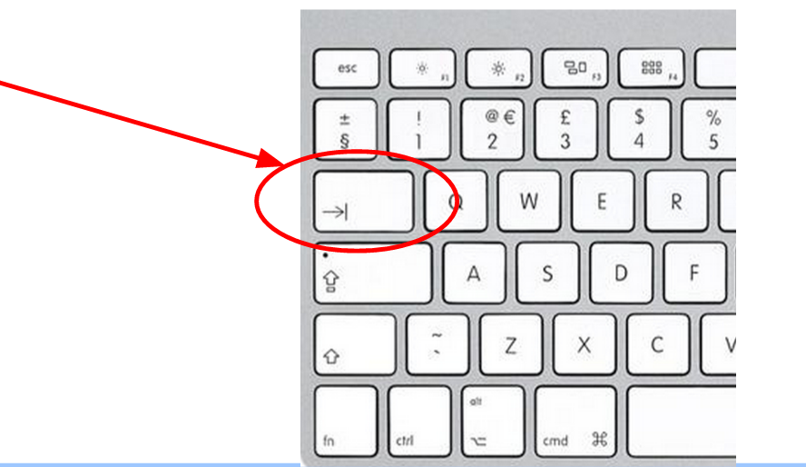

# Data Formatting Issues

---

# Data

- Numbers, names, dates, …
- Graphs, images, …
- Organised in tables,  list, ...
- Popular file formats:  `.txt`, `.csv`, `.xls`

---

# 1st Rule

- Always, always **RAW** data
- NOT 
    + processed, 
    + filtered 
    + manipulated 
    + either electronically or manually

---

# 1st Rule - Why?

- Maintain consistency
    + Data format
    + Codes (M/F)
    + Separator , ; \t
- Reduce human errors
    + Copy / Paste / Cut
    + Deletion
Addition unwanted characters
- Reduce machine errors
    + Cell formats
    + Save file with a different extension

---

# 2nd Rule - Maintain consistency

---

# Example 1

| Patient ID | Sex    | Date of birth     |
|------------|--------|-------------------|
| 1          | M      | 01-01-2013        |
| 2          | f      | 04-18-1998        |
| 3          | Male   | 1st of April 2004 |
| 4          | Female | NA                |
| 5          | F      | 2010/03/12        |
| 6          | F      |                   |
| 7          | M      | 10012012          |

---

# Example 1

- Consistency: F, female, f, fem, 2, …
- Single common format for all dates: YYYYMMDD, YYYY-MM-DD
    + http://www.iso.org/iso/home/standards/iso8601.htm
- Consistency about missing values
    + NA (not available), NULL,     , ...

---

# Example 1 - corrected

| Patient ID | Sex  | Date of birth |
|------------|------|---------------|
| 1          | M    | 2013-01-01    |
| 2          | F    | 1998-04-18    |
| 3          | M    | 2004-04-01    |
| 4          | F    | NA            |
| 5          | F    | 2010-03-12    |
| 6          | F    | NA            |
| 7          | M    | 2012-01-10    |

---

# A bit more about consistency

- Realistic and easy to understand
    + Variable names
    + File names
- Unique and consistent variable names
    + Multiple tables
    
---

# 3rd Rule

## Missing values = NA

---

# Blank spaces

- Careful!!!

- Blank cell ≠ space
- “Male” ≠ “ Male “
- Last line: “ “ 
    + These can be a headache later on!

---

# Example 2

| Patient ID | Date       | Value |
|------------|------------|-------|
| 1          | 2015-06-14 | 213   |
| 2          |            | 76.5  |
| 3          | 2015-06-18 | 32    |
| 4          |            | 120.3 |
| 5          |            | 109   |
| 6          | 2015-06-20 |       |
| 7          |            | 143   |

---

# Example 2

- It is tempting to make the table look cleaner by not repeating some values
- Fill in all cells!
    + Problems when sorting
- Empty cell:
    + Missing value?
    + Value meant to be repeated multiple times?
- Make sure it’s clear that the data is missing and not unintentionally left blank

---

# Example 2 Corrected

| Patient ID | Date       | Value |
|------------|------------|-------|
| 1          | 2015-06-14 | 213   |
| 2          | 2015-06-14 | 76.5  |
| 3          | 2015-06-18 | 32    |
| 4          | 2015-06-18 | 120.3 |
| 5          | 2015-06-18 | 109   |
| 6          | 2015-06-20 |       |
| 7          | 2015-06-20 | 143   |

---

# Rule 4

## Make it rectangle

---

# Example 3

---

# Example 3 Corrected

---

# More

- Don’t put too much information in one cell
    + 1 cell = 1 piece of information
- Don’t include units such as "30 g" → "g" in the column name
    + http://unitsofmeasure.org/ucum.html 
- Write notes in a separate column or data dictionary or metadata 
    + "0 (below threshold)"
- Avoid using "," or ";" or tab
- Do not manually modify or copy values

---

# More

- NO calculations
- NO font colours
- NO highlighting

Computer doesn’t recognize it!

---

# Good versus Bad Names

| Good Name | Alternative Name | Bad Name                |
|-----------|------------------|-------------------------|
| MaxTemp   | max_temp         | Maximum Temperature (C) |
| Quantity  | Quantity_mg      | Quamg                   |
| Sex       |                  | M/F                     |
| Weight    | Weight_kg        | w                       |

---

# Write Protection

Mac 

- Right click on the file in Finder
- Select “Get Info”
- Sharing and permission
- Priviledge
- Read only

---

# Write Protection

Windows

- Right click on the file in windows explorer
- Properties
- General tab
- Attributes
- Select the box for “read only” 

---

# Data Validation

- Excel data validation feature
- Select a column
    + In the menu bar, choose “Data”
    + Validation
- Integer or decimal number
- Range
- List of possible values
- Limited length text

---

# Be careful

- When identifiers are long integers
    + 1000000 = 1e06
- Do not fill blank cells with 0s
    + 0s are data!
- [Excel can convert gene names to dates](https://genomebiology.biomedcentral.com/articles/10.1186/s13059-016-1044-70)
    + SEPT2 (Septin 2) → ‘2-Sep’
    + MARCH1 (Membrane-Associated Ring Finger (C3HC4) 1, E3 Ubiquitin Protein Ligase) → ‘1-Mar’

---
    
# How to save

- Tab delimited
    + , or ; separated

- Such as .csv or .txt

---
