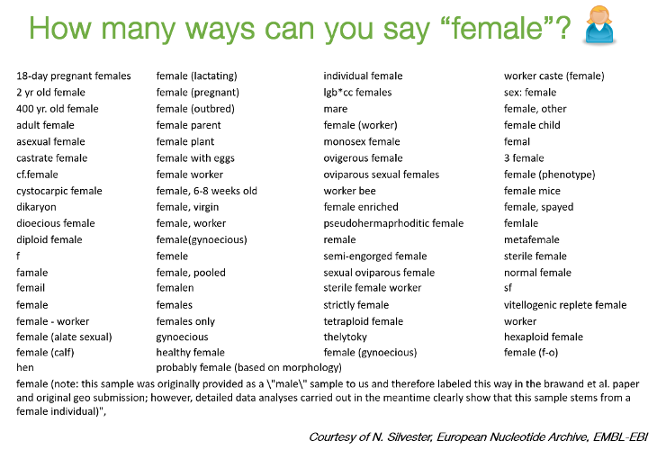
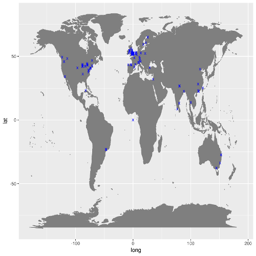
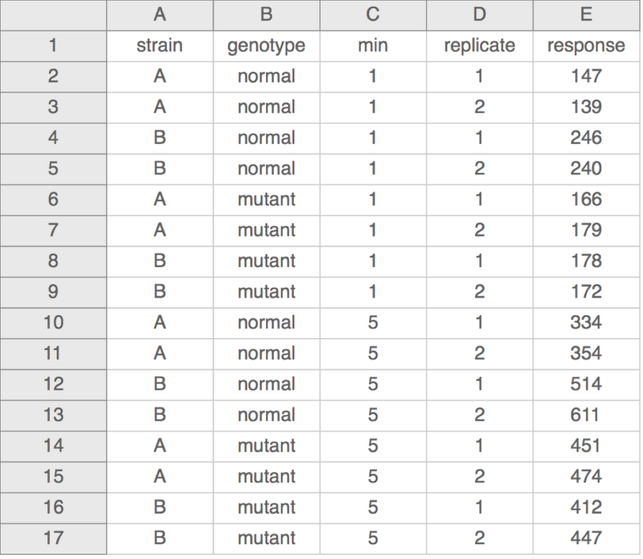

# Data Formatting Issues

---

# Reproducible Research

- At some point in the future, someone, somewhere, might want to repeat your analysis for themselves or re-use your data. 
    + which will most likely be ***you!***
- Assuming that you'll be able to remember all the steps involved is dangerous, so making sure that everything is well-documented is key. 
- The documentation involves not only the methods used, but the files used as input and any transformations performed on them. 

---

# Five selfish reasons

- Florian Markowetz has a great talk on why we should work reproducibly 
- There is a [Genome Biology paper](http://genomebiology.biomedcentral.com/articles/10.1186/s13059-015-0850-7) that you should read.

---

# A famous example
- Probably the most (in)famous example of failure to reproduce a study, which actually *put people's lives at risk* and [rallied statisticians into action](http://www.nytimes.com/2011/07/08/health/research/08genes.html)
- Keith Baggerly's lecture on the scandal is a ***must-see***.

<iframe width="560" height="315" src="https://www.youtube.com/embed/7gYIs7uYbMo" frameborder="0" allowfullscreen></iframe>

---

# But tools like R have been around for years; why is this still an issue?

- R is only part of the solution
- Say you use an R script to generate a list of interesting genes and come to publish
    + which set of samples was used....the one with that dodgy sample removed
    + didn't you change the version of the software and re-run it?
- Need complete control over the files and data associated with your project

---

# Barriers to learning R, Python etc

- From experience, the biggest hurdle that newbies face is trying to read and analyse your own data
- Often not because you have not understood the course materials....
- ....but because the data have been managled into a form that the computer cannot process. 
- there's a danger of becoming de-motivated and resorting back to whatever software you were using before.

---

# Are spreadsheets programs like Excel evil?

- ....Not neccesarily.
- Often much more convenient to eye-ball a spreadsheet and get an overall impression of your data. 
- But they have *limitations* making them not ideal for large-scale analyses. 
- Doing things by-hand only invites you to make copy-and-paste errors etc

---

# Rule 1

[http://www.inquisitr.com/309687/jesus-painting-restoration-goes-wrong-well-intentioned-old-lady-destroys-100-year-old-fresco/](http://www.inquisitr.com/309687/jesus-painting-restoration-goes-wrong-well-intentioned-old-lady-destroys-100-year-old-fresco/)

---

# Rule 1

- Always, always **RAW** data
- NOT 
    + processed, 
    + filtered 
    + manipulated 
    + either electronically or manually

---

# Rule 1 - Why?

- Reduce human errors
    + Copy / Paste / Cut
    + Deletion
- Reduce machine errors
    + Cell formats
    + Save file with a different extension
- Ask your Bioinformatician / Statistician what form they would like the data in
    + response will probably as "raw" as possible
    + i.e. before it has been touched by human hand
    
---

# Rule 2

---

# Rule 2 - Maintain consistency

---

# Example 1

| Patient ID | Sex    | Date of birth     | Tumour Size
|------------|--------|-------------------|------------
| 1          | M      | 01-01-2013        |     3.1
| 2          | f      | 04-18-1998        |     1.5
| 3          | Male   | 1st of April 2004 |     105
| 4          | Female | NA                |     67
| 5          | F      | 2010/03/12        |     4.2
| 6          | F      |                   |     3.6
| 7          | M      | 10012012          |     232

---

# Example 1

- Consistency: F, female, f, fem, 2, …
- Single common format for all dates: YYYYMMDD, YYYY-MM-DD
    + http://www.iso.org/iso/home/standards/iso8601.htm
- Units
    + cm or mm
    + days, months or years
- You can introduce inconsistencies without realising it
    + blank spaces (whitespace) at the end of text
    + "Male " is not the same as "Male"
- Document choices you make about units in a *README* file

---

# Example 1 - corrected

| Patient ID | Sex  | Date of birth | Tumour Size
|------------|------|---------------|------------
| 1          | M    | 2013-01-01    |   3.1 
| 2          | F    | 1998-04-18    |   1.5
| 3          | M    | 2004-04-01    |   1.05
| 4          | F    | NA            |   0.67
| 5          | F    | 2010-03-12    |   4.2
| 6          | F    | NA            |   3.6
| 7          | M    | 2012-01-10    |   2.32

---

# Rule 3

Figure showing locations of visitors to my Prostate Cancer [data portal](http://bioinformatics.cruk.cam.ac.uk/apps/camcAPP/)

---

# Rule 3 - Don't use 0 to mean missing

- Zero values are data!
    + Sometimes extreme values such as 999 are sometimes used
- `NA` is Ok, but what if NA is a valid category in your data?
    + R will recognise `NA` as a missing value and can ignore it in calculations
    + you can define what text is used to represent missing (NULL, None,"-")
- Safest to leave the cell *empty*
    + but you need to be careful with blank spaces

---

# Rule 4

| Patient ID | Date       | Value |
|------------|------------|-------|
| 1          | 2015-06-14 | 213   |
| 2          |            | 76.5  |
| 3          | 2015-06-18 | 32    |
| 4          |            | 120.3 |
| 5          |            | 109   |
| 6          | 2015-06-20 |       |
| 7          |            | 143   |

---

# Rule 4 

## Fill in all the cells

---

# Rule 4

- It is tempting to make the table look cleaner by not repeating some values
- Fill in all cells!
    + Problems when sorting
- Empty cell:
    + Missing value?
    + Value meant to be repeated multiple times?
- Make sure it’s clear that the data is missing and not unintentionally left blank

---

# Example 2 Corrected

| Patient ID | Date       | Value |
|------------|------------|-------|
| 1          | 2015-06-14 | 213   |
| 2          | 2015-06-14 | 76.5  |
| 3          | 2015-06-18 | 32    |
| 4          | 2015-06-18 | 120.3 |
| 5          | 2015-06-18 | 109   |
| 6          | 2015-06-20 |       |
| 7          | 2015-06-20 | 143   |

---

# Rule 5

## Make it rectangle

- The computer expects a very rigid shape of data with rows and columns

---

# More

- Don’t put too much information in one cell
    + 1 cell = 1 piece of information
- Don’t include units such as "30 g" → "g" in the column name
    + http://unitsofmeasure.org/ucum.html 
- Write notes in a separate column or data dictionary or metadata 
    + "0 (below threshold)"
- Avoid using "," or ";" or tab
- Do not manually modify or copy values

---

# More

- NO calculations
- NO font colours
- NO highlighting

Computer doesn’t recognize it!

---

# Make your data rectangular

---

# Rule 5

---

# Write Protection

Mac 

- Right click on the file in Finder
- Select “Get Info”
- Sharing and permission
- Priviledge
- Read only

---

# Write Protection

Windows

- Right click on the file in windows explorer
- Properties
- General tab
- Attributes
- Select the box for “read only” 

---

# Data Validation

- Excel data validation feature
- Select a column
    + In the menu bar, choose “Data”
    + Validation
- Integer or decimal number
- Range
- List of possible values
- Limited length text

---

# "Helpful" features in Excel

- When identifiers are long integers
    + 1000000 = 1e06
    + [Issue with Illumina microaray chip IDs](https://support.illumina.com/bulletins/2016/10/important-information-about-using-digit-beadchip-barcodes-in-genomestudio-sample-sheets.html)
- [Excel can convert gene names to dates](https://genomebiology.biomedcentral.com/articles/10.1186/s13059-016-1044-70)
    + SEPT2 (Septin 2) → ‘2-Sep’
    + MARCH1 (Membrane-Associated Ring Finger (C3HC4) 1, E3 Ubiquitin Protein Ligase) → ‘1-Mar’

---

# Practice

- Look at the file `patient-data.txt`
    + a simulated, but representative, example of ***bad data***
    + discuss with your neighbours
- The next step is to look at how to clean the data with Open Refine

---

---
